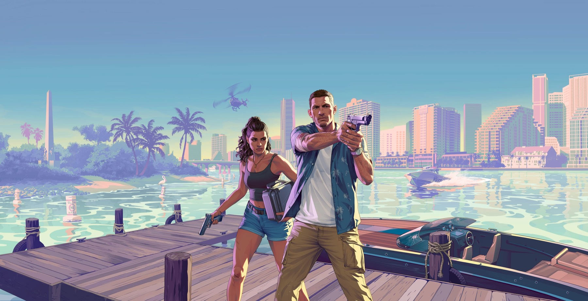

<div align="center">



<br />
<br />

<h1>GRAND THEFT AUTO VI</h1>

### A scroll-driven cinematic landing page, built for the love of it.

No frameworks-of-the-week, no client, no deadline — just a trailer I couldn't stop rewatching
and a weekend that turned into something bigger.

<br />

<a href="#getting-it-running"></a>
<a href="#the-scroll-timeline"></a>
<a href="#design-system"></a>
<a href="#architecture"></a>

<br />
<br />


</div>

<br />

---

## The short version

I watched the GTA VI trailer far too many times, went looking at how Rockstar's reveal site felt, and thought: *I want to build that.* Not clone the markup — rebuild the **feeling**. The slow pull-back of the logo. The way footage moves because *you* moved. The moment the release date lands.

So this is my hand-built take on it. Every section is a small animation puzzle I sat with until it felt right, then rewrote once more because it almost felt right.

The whole page runs on one idea: **your scrollbar is the playhead.** Nothing autoplays. Nothing fades in on a timer. You scroll, the film moves. Scroll back, it rewinds.

> [!NOTE]
> A fan project, made with love and zero commercial intent. Every frame, logo, and piece of artwork belongs to **Rockstar Games** — I just arranged them on a page.

<br />

## Getting it running

```bash
git clone https://github.com/DEEPESH-845/GTA-VI.git
cd GTA-VI
npm install
npm run dev
```

Open **http://localhost:5173**, then scroll *slowly* the first time. Seriously — the fun is in the pacing.

| Script | What it does |
| :--- | :--- |
| `npm run dev` | Vite dev server with HMR |
| `npm run build` | Production bundle → `dist/` |
| `npm run preview` | Serve the built bundle locally |
| `npm run lint` | ESLint across the project |

> [!TIP]
> There are ~12 trailer clips in `public/videos/`, so the first load is genuinely doing work. That preloader isn't decoration — it's buying the browser time.

<br />

## The scroll timeline

Think of it as a storyboard. Each stage grabs the viewport, plays its part, and passes the baton.

| # | Stage | Component | What happens |
| :-: | :--- | :--- | :--- |
| 00 | **Preload** | `PreLoader.jsx` | Shimmering logo mask, ~4.3 s floor, exits on `window.load` |
| 01 | **Mask reveal** | `Hero.jsx` | Logo scales from `3500%` → `20%`, carving the trailer out of black |
| 02 | **Trailer I** | `FirstVideo.jsx` | Pinned 200 vh; `video.currentTime` is tweened by scroll |
| 03 | **Jason Duval** | `Jason.jsx` | Character bio; imagery drifts `-300px` on a parallax rail |
| 04 | **Trailer II** | `SecondVideo.jsx` | Second scrubbed clip, cross-faded from the bio |
| 05 | **Lucia Caminos** | `Lucia.jsx` | Mirrored bio; imagery drifts `-200px`, trailer II fades out |
| 06 | **Postcard** | `PostCard.jsx` | Scrubbed Leonida Keys clip under an animated gradient, tilt on hover |
| 07 | **Final cut** | `Final.jsx` | Pinned close-out, scrub `0.65`, `anticipatePin` for a clean lock |
| 08 | **Outro** | `Outro.jsx` | Logo lockup + **November 19, 2026** |

<details>
<summary><b>My favourite trick: scrubbing video with the scrollbar</b></summary>

<br />

I assumed this needed a canvas and a pile of extracted frames. It doesn't. A `<video>` element's `currentTime` is just a number — so GSAP can tween it like any other property, and ScrollTrigger can drive that tween:

```js
videoRef.current.onloadedmetadata = () => {
  tl.to(videoRef.current, {
    currentTime: videoRef.current.duration,
    duration: 3,
    ease: "power1.inOut",
  }, "<");
};
```

The `onloadedmetadata` wrapper cost me an evening. `duration` is `NaN` until the browser reads the file header, so if you register the tween any earlier, GSAP happily animates toward `NaN` and nothing moves — silently, with no error to chase.

</details>

<details>
<summary><b>The hero mask, explained</b></summary>

<br />

The hero is a CSS `mask-image` of the GTA VI logo laid over the trailer. Shrink `mask-size` from `3500%` down to `20%` and it reads as the logo *pulling back* out of a black screen. It's one property doing all the work.

The numbers had to change per screen size, so they live in one hook instead of being scattered through the component:

```js
// constants/index.js
useMaskSettings() // → { initialMaskPos, initialMaskSize, maskPos, maskSize }
```

Mobile pulls from `-1500vh`, tablet from `-1700vh`, desktop stays centred at `50% 22%`. Those are tuned-by-eye values — I moved them until it stopped feeling wrong.

</details>

<br />

## Architecture

```
GTA VI/
├── index.html                 # Paints #17172A before React boots (no white flash)
├── constants/index.js         # Video IDs + responsive mask settings
├── public/
│   ├── videos/                # 12 trailer clips
│   ├── images/                # ~44 stills, logos, shards
│   └── fonts/                 # Long · Round · Round Bold (.woff)
└── src/
    ├── App.jsx                # Preloader gate → section order
    ├── index.css              # Tailwind 4 @theme, fonts, gradients
    ├── components/
    │   ├── PreLoader.jsx      # Shimmer mask + load-aware exit
    │   └── LenisProvider.tsx  # Smooth-scroll RAF wrapper
    ├── sections/              # One file per timeline stage
    └── tokens/                # The design system, as JS
```

**Three rules I kept to, mostly for my own sanity:**

1. **One section, one file, one timeline.** Sections never reach into each other's animations — that way a broken scroll is always one file's fault.
2. **No raw hex in components.** Colour, spacing, and motion values come from `src/tokens/`.
3. **Breakpoint logic lives in hooks**, never scattered across media queries.

<br />

## Design system

I pulled the palette straight off the official site with a colour picker and far too much patience, then made it a real token layer in `src/tokens/`:

```js
import tokens, { colors, motion } from "./tokens";

colors.accent.yellow          // #FFF9CB
motion.duration.videoScrub    // 3000
motion.lenis                  // full smooth-scroll config
```

**Palette**

| | Token | Value | Used for |
| :-: | :--- | :--- | :--- |
|  | `accent.yellow` | `#FFF9CB` | Headings, borders, CTAs |
|  | `accent.pink` | `#FFB0C4` | Subheads, hover glow |
|  | `accent.orange` | `#FCAF17` | Gradient title stop |
|  | `accent.red` | `#E84C22` | Gradient title stop |
|  | `background.secondary` | `#17172A` | Page base |
|  | `background.primary` | `#0B0C14` | Deepest dark |

**Type** — `Long` for display caps, `Round` / `Round Bold` for body. Self-hosted `.woff`, so there's no font request going anywhere.

**Motion** — durations, GSAP easings, stagger steps, spring configs, Lenis and ScrollTrigger defaults all live in `tokens/motion.js`. When the pacing felt off, I wanted to fix it in one file instead of hunting through nine sections. Worth every minute.

<br />

## Things I learned the hard way

| Problem | What actually fixed it |
| :--- | :--- |
| Scroll felt twitchy | Lenis at `lerp 0.06` / `duration 2.4`, with lighter values on mobile and tablet |
| Pinned sections jumped | ScrollTrigger `anticipatePin: 1` plus `invalidateOnRefresh` |
| White flash before React | Background colour inlined in `index.html`; `main` stays `opacity-0` until the preloader resolves |
| Ghost tweens after remount | `useGSAP()` from `@gsap/react` — it reverts everything on unmount, for free |
| Desktop timings felt wrong on phones | `react-responsive` hooks feeding different mask + Lenis values per breakpoint |

<br />

## Still on my list

Being honest rather than pretending it's finished:

- [ ] Wire up `prefers-reduced-motion` — it's defined in the tokens but the choreography still plays regardless.
- [ ] Settle the occasional fight between Lenis inertia and GSAP `scrub` on touch devices.
- [ ] Add `alt` text to the images that are still missing it.
- [ ] Build the extra routes sketched out in `PRODUCT.md` (Leonida, Media) — they're not in `src/` yet.

If you spot something, or just want to argue about easing curves, open an issue. I'd genuinely enjoy that.

<br />

## Thanks to

[GSAP](https://gsap.com) · [React](https://react.dev) · [Tailwind CSS](https://tailwindcss.com) · [Vite](https://vitejs.dev) · [Lenis](https://lenis.darkroom.engineering)

...and to Rockstar, for making a trailer good enough to send me down this hole in the first place.

<div align="center">

<br />

**COMING NOVEMBER 19, 2026**

<sub>Made with love by <a href="https://github.com/DEEPESH-845">@DEEPESH-845</a> · Fan project, not affiliated with Rockstar Games · All assets © Rockstar Games</sub>

</div>
